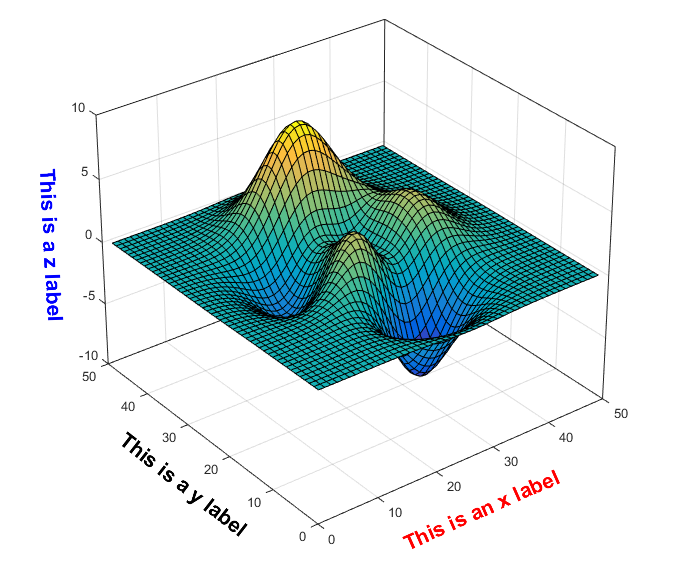

# Tools for Axis Label Alignment in MATLAB
<!--  -->


This is a simple MATLAB function for axis label alignment. If you have ever struggled with the label alignment issue in MATLAB's 3-D plots --- by default axis labels are placed horizontally no matter how you rotate the plot --- [here](https://www.mathworks.com/matlabcentral/fileexchange/49542-tools-for-axis-label-alignment-in-3d-plot) is a simple fix.

It still works when `Projection` mode is `Perspective` or when `DataAspectRatio` is not `[1 1 1]`.

## Functions
- `align_axislabel`: it rotates $x$, $y$ and $z$ labels to the direction of their corresponding axes and moves the labels to a proper distance from the axes;
- `align_axislabel_log`: supports log-scale in $z$ axis;
- `axislabel_rotation`: it performs rotation only;
- `axislabel_rotation_angle`: it computes the angles of $x$, $y$ and $z$ labels to be rotated properly (without performing the actual rotation);
- `axislabel_translation`: it moves axis labels to a proper distance from the axes;
- `axislabel_translation_slider`: a GUI slider for setting parameters `AXISALIGN_TRANS_A` and `AXISALIGN_TRANS_B`.

## Usage:
### Common usage
Label alignment plus GUI slider:
```
z = peaks;
figure('color', [1 1 1])
surf(z);
set(gca, 'dataaspectratio', [1 1 0.5], 'projection', 'perspective', 'box', 'on')
xlabel('This is an x label', 'fontsize', 16, 'fontweight', 'bold', 'color', [1 0 0])
ylabel('This is a y label', 'fontsize', 16, 'fontweight', 'bold', 'color', [0 0 0])
zlabel('This is a z label', 'fontsize', 16, 'fontweight', 'bold', 'color', [0 0 1])

% Add the following after you plot your figures
h = rotate3d;
set(h, 'ActionPreCallback', 'set(gcf,''windowbuttonmotionfcn'',@align_axislabel)')
set(h, 'ActionPostCallback', 'set(gcf,''windowbuttonmotionfcn'','''')')
set(gcf, 'ResizeFcn', @align_axislabel)
align_axislabel([], gca)
axislabel_translation_slider;

```

### Align labels simultaneously while rotating the plot
If you would like to see immediate effect, set `align_axislabel` as the `WindowButtonMotionFcn` (callback) of the current figure. You might only want to do this after you clicked your mouse and started rotating the plot. Here's an example:
```
figure;
axes('box','on','dataaspectratio',[1 1 1],'projection','perspective');
xlabel('This is an x label')
ylabel('This is a y label')
zlabel('This is a z label')

h = rotate3d;
set(h, 'ActionPreCallback', 'set(gcf,''windowbuttonmotionfcn'',@align_axislabel)')
set(h, 'ActionPostCallback', 'set(gcf,''windowbuttonmotionfcn'','''')')

```
Simply add the last three lines after your own plot. **You need to rotate it first to see the effect, or manually call `align_axislabel([], gca)`.**

### You can also do this
If you set `align_axislabel` as `ActionPostCallback`, you will only see the effect after you release the left button of your mouse (after you finished rotating the plot):
```
h = rotate3d;
set(h,'ActionPostCallback',@align_axislabel)
```

### Use the GUI sliders
If you think the labels are placed either too close to or far away from the axes, add this (after setting those callbacks):
```
axislabel_translation_slider;
```

See `demo.m` for more information.
